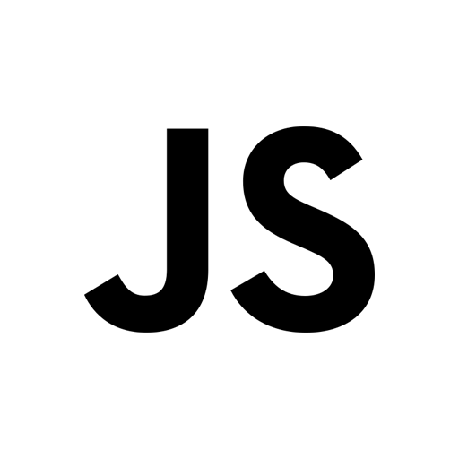
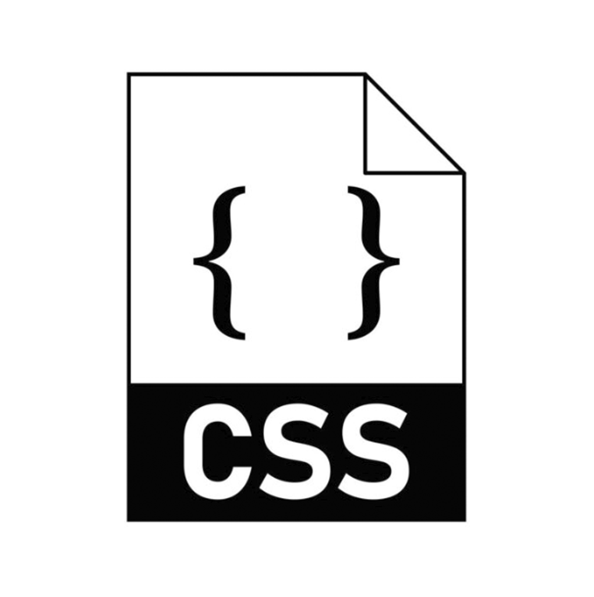
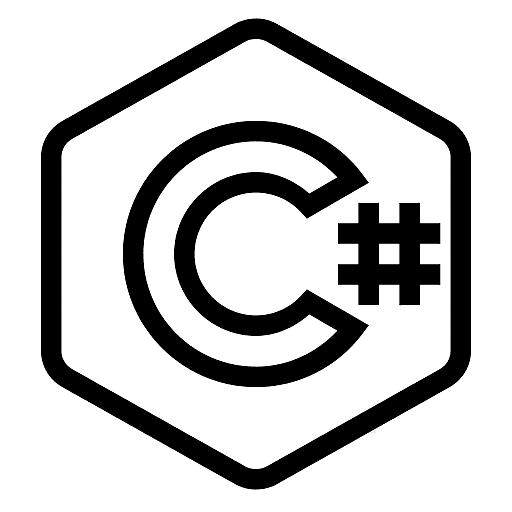
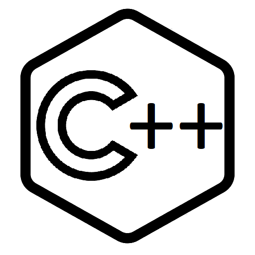
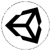

[][telegram]
[][vk]
[][steam]
[][discord]
[][github]
 

### Languages
[][python]
[][js]
[][html]
[][css]
[][charp]
[][java]
[][cpp]
 

### Tools
[][steamVR]
[][vs2019]
[][pycharm]
[][idea]
[][unity]
[][gitkraken]
 

### Databases
[][mysql]
[][pgsql]
[][sqlite]
[][cassandra]
 
<!--
### Spotify now playing

-->

    
<b>Stats</b>

     

    
<b>Wakatime</b>

     
    

[telegram]: https://t.me/Delivery_Klad
[vk]: https://vk.com/delivery_klad
[steam]: https://steamcommunity.com/id/DakFadeev
[discord]: https://discord.gg/6J5H3hc
[vs2019]: https://visualstudio.microsoft.com
[pycharm]: https://www.jetbrains.com/ru-ru/pycharm
[idea]: https://www.jetbrains.com/ru-ru/idea
[github]: https://github.com/Delivery-Klad
[gitkraken]: https://www.gitkraken.com
[unity]: https://unity.com
[python]: https://www.python.org
[charp]: https://docs.microsoft.com/ru-ru/dotnet/csharp
[java]: https://www.java.com/ru/
[mysql]: https://www.mysql.com
[pgsql]: https://www.postgresql.org
[sqlite]: https://www.sqlite.org
[cassandra]: https://cassandra.apache.org
[redis]: https://redis.io
[cpp]: https://docs.microsoft.com/ru-ru/cpp
[steamVR]: https://store.steampowered.com/app/250820/SteamVR
[js]: https://www.javascript.com
[html]: https://t.me/Delivery_Klad
[css]: https://t.me/Delivery_Klad
[rabbitmq]: https://www.rabbitmq.com
