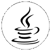

### Contact with me
 
[][telegram]
[][vk]
[][steam]
[][discord]
 
### Languages and Tools
 
    [][vs2019]
    [][pycharm]
    [][idea]
    [][unity]
    [][steamVR]
    [][charp]
    [][java]
    [][cpp]
    [][python]
    [][gitkraken]
    [][github]
 
 
### Databases
 
    [][mysql]
    [][pgsql]
    [][sqlite]
    [][cassandra]
 
 
### Spotify now playing
 
    

Stats

 

<!--
- 🔭 I’m currently working on ...
- 🌱 I’m currently learning ...
- 👯 I’m looking to collaborate on ...
- 🤔 I’m looking for help with ...
- 💬 Ask me about ...
- 📫 How to reach me: ...
- 😄 Pronouns: ...
- ⚡ Fun fact: ...
-->

[telegram]: https://t.me/Delivery_Klad
[vk]: https://vk.com/delivery_klad
[steam]: https://steamcommunity.com/id/DakFadeev
[discord]: https://discord.gg/6J5H3hc
[vs2019]: https://visualstudio.microsoft.com
[pycharm]: https://www.jetbrains.com/ru-ru/pycharm
[idea]: https://www.jetbrains.com/ru-ru/idea
[github]: https://github.com/Delivery-Klad
[gitkraken]: https://www.gitkraken.com
[unity]: https://unity.com
[python]: https://www.python.org
[charp]: https://docs.microsoft.com/ru-ru/dotnet/csharp
[java]: https://www.java.com/ru/
[mysql]: https://www.mysql.com
[pgsql]: https://www.postgresql.org
[sqlite]: https://www.sqlite.org
[cassandra]: https://cassandra.apache.org
[cpp]: https://docs.microsoft.com/ru-ru/dotnet/csharp
[steamVR]: https://store.steampowered.com/app/250820/SteamVR
